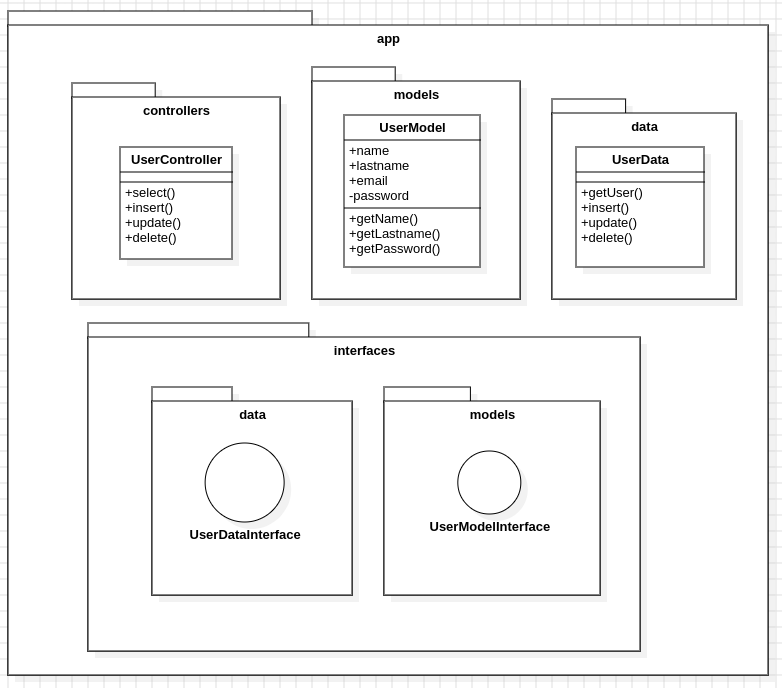
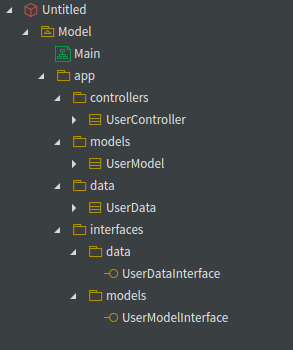
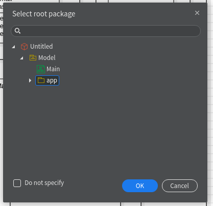
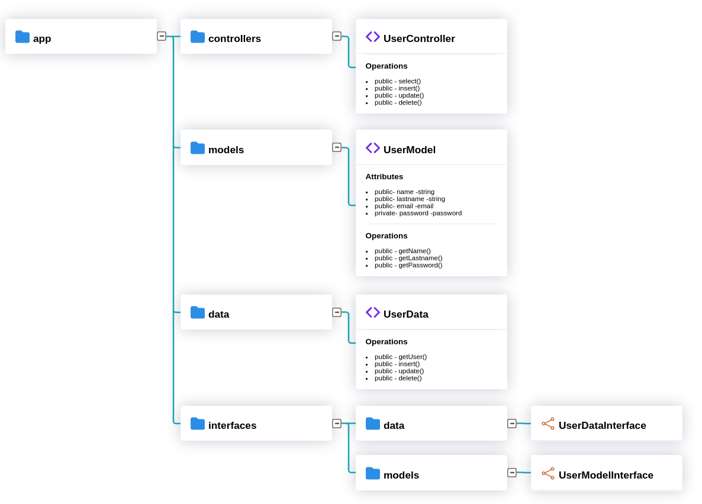

# Savne staruml plumb tree

Savne staruml plumb tree is an extension created by employees of 
[Savne SAS](https://savne.net) and free to use for anyone.

This tool will allow you to export class diagrams made in
StarUML to tree diagrams in HTML, where you can visualize the
distribution of packages, their content in classes and interfaces.

---
### Use

1. You will need to create your class diagram in StarUML.

2. Make sure that the distribution in your project is well defined,
that is, the elements are well distributed within the packages.

3. Select the Savne Plumb Tree option found in the menu of
StarUML in the tools section.

4. In the pop-up window you must select the package you want to export, 
in this case it would be app.

5. A window will appear where you must select the location where
   the folder with the HTML diagram and its dependencies will be saved.

6. In your file manager go to the location where I saved
   your folder and find your tree diagram.

Finally open exported your class diagram in StarUML to HTML.  